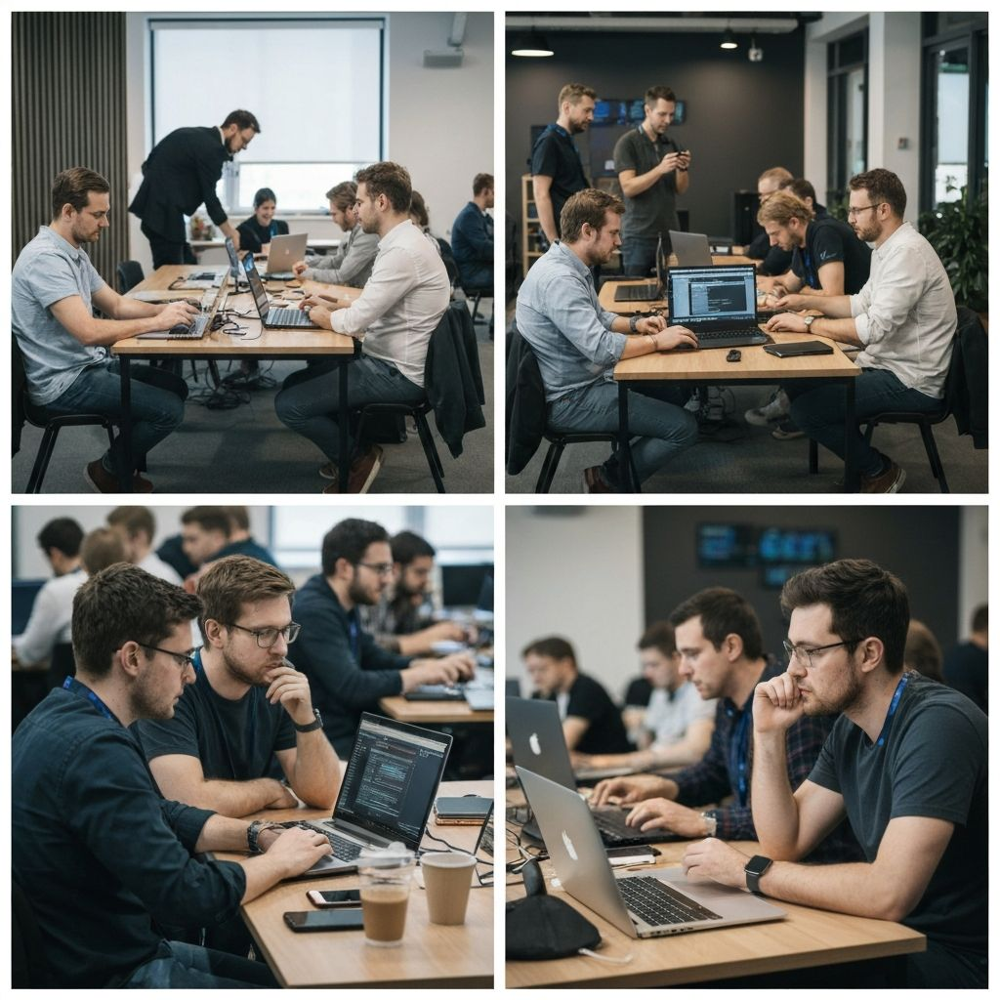

# 🚀 NEXATHON 2025 Website - Complete Handover Documentation

> **Project:** NEXATHON 2025 Hackathon Website  
> **Framework:** Next.js 16.0.10 (App Router)  
> **Language:** TypeScript  
> **Styling:** Tailwind CSS v4  
> **Status:** Production Ready

---

## 📋 Table of Contents

1. [Project Overview](#project-overview)
2. [Tech Stack & Dependencies](#tech-stack--dependencies)
3. [Project Structure](#project-structure)
4. [Key Components Deep Dive](#key-components-deep-dive)
5. [Styling System](#styling-system)
6. [Special Features & Animations](#special-features--animations)
7. [Configuration Files](#configuration-files)
8. [Common Tasks & Workflows](#common-tasks--workflows)
9. [Troubleshooting Guide](#troubleshooting-guide)
10. [Deployment](#deployment)
11. [Important Notes & Gotchas](#important-notes--gotchas)

---

## 🎯 Project Overview

This is a **single-page application (SPA)** for the NEXATHON 2025 hackathon event. The website features:

- **Dark tech-themed design** with cyberpunk aesthetics
- **Smooth animations** and 3D effects throughout
- **Responsive design** for all screen sizes
- **Accessibility features** (reduced motion support, ARIA labels)
- **SEO optimized** with proper metadata
- **Performance optimized** with Next.js App Router

### Main Sections (in order):
1. **Hero Section** - Landing with animated background
2. **About Section** - Event information and stats
3. **Schedule Section** - 3-day event timeline
4. **Timeline Section** - Registration milestones
5. **Sponsors Section** - Sponsor showcase
6. **Rewards Section** - Prize information
7. **Register Section** - Registration form
8. **Theme Section** - Hackathon themes
9. **FAQ Section** - Frequently asked questions
10. **Gallery Section** - Image carousel
11. **Contact Section** - Contact information
12. **Footer** - Links and back-to-top button

---

## 🛠 Tech Stack & Dependencies

### Core Framework
- **Next.js 16.0.10** - React framework with App Router
- **React 19.2.0** - UI library
- **TypeScript 5** - Type safety

### Styling
- **Tailwind CSS 4.1.9** - Utility-first CSS framework
- **PostCSS 8.5** - CSS processing
- **tw-animate-css 1.3.3** - Additional animations
- **Custom CSS utilities** - Extensive custom animations in `globals.css`

### UI Components
- **Radix UI** - Headless UI primitives (Accordion, Dialog, Tabs, etc.)
- **Lucide React** - Icon library
- **shadcn/ui** - Component library (configured via `components.json`)

### Animation & Effects
- **Framer Motion 12.23.26** - Advanced animations (used in some components)
- **Three.js 0.182.0** - 3D graphics for shader effects
- **Custom CSS animations** - Extensive keyframe animations

### Forms & Validation
- **React Hook Form 7.60.0** - Form management
- **Zod 3.25.76** - Schema validation
- **@hookform/resolvers 3.10.0** - Form validation resolvers

### Utilities
- **clsx** - Conditional class names
- **tailwind-merge** - Merge Tailwind classes
- **class-variance-authority** - Component variants
- **date-fns 4.1.0** - Date formatting

### Analytics
- **@vercel/analytics 1.3.1** - Vercel Analytics integration

### Development Tools
- **ESLint** - Code linting
- **TypeScript** - Type checking

---

## 📁 Project Structure

```
v0-nexathonDemo/
├── app/                          # Next.js App Router directory
│   ├── globals.css              # Global styles & Tailwind config
│   ├── layout.tsx               # Root layout with fonts & metadata
│   └── page.tsx                 # Main page (composes all sections)
│
├── components/                   # React components
│   ├── ui/                      # Reusable UI components
│   │   ├── shader-animation.tsx # Three.js shader background
│   │   └── timeline.tsx        # Timeline component
│   │
│   ├── about-section.tsx        # About section component
│   ├── animated-counter.tsx     # Number counter animation
│   ├── contact-cta.tsx          # Call-to-action component
│   ├── contact-section.tsx      # Contact information
│   ├── faq-section.tsx          # FAQ accordion
│   ├── floating-particles.tsx   # Animated floating particles
│   ├── footer.tsx               # Footer with back-to-top
│   ├── gallery-section.tsx      # Image gallery carousel
│   ├── hero-section.tsx         # Hero landing section
│   ├── matrix-background.tsx    # Matrix rain effect
│   ├── navbar.tsx               # Navigation bar
│   ├── parallax-section.tsx    # Parallax effects
│   ├── register-section.tsx     # Registration form
│   ├── rewards-section.tsx      # Prizes showcase
│   ├── schedule-section.tsx     # Event schedule
│   ├── scroll-animation.tsx     # Scroll-triggered animations
│   ├── section-header.tsx       # Reusable section headers
│   ├── sponsors-section.tsx     # Sponsor logos
│   ├── theme-provider.tsx       # Theme context (if needed)
│   ├── theme-section.tsx        # Hackathon themes
│   └── tilt-card.tsx            # 3D tilt card effect
│
├── lib/                          # Utility functions
│   └── utils.ts                 # cn() helper for class merging
│
├── public/                       # Static assets
│   ├── *.jpg, *.png             # Gallery images
│   ├── icon-*.png               # Favicons
│   └── placeholder.*            # Placeholder images
│
├── styles/                       # Additional styles (if any)
│   └── globals.css              # (duplicate or backup)
│
├── components.json               # shadcn/ui configuration
├── next.config.mjs               # Next.js configuration
├── package.json                  # Dependencies & scripts
├── postcss.config.mjs            # PostCSS configuration
├── tsconfig.json                 # TypeScript configuration
└── README.md                     # Project readme
```

---

## 🧩 Key Components Deep Dive

### 1. **app/page.tsx** - Main Page Composition

**Purpose:** Composes all sections in order.

**Key Points:**
- Uses `<main>` wrapper with background effects
- Includes `MatrixBackground` for animated background
- All sections wrapped in relative z-10 container
- Sections use `id` attributes for anchor navigation

**Structure:**
```tsx
<main className="relative min-h-screen bg-background overflow-x-hidden noise-overlay scanlines">
  <MatrixBackground />
  <div className="relative z-10">
    <Navbar />
    <HeroSection />
    <AboutSection />
    // ... all other sections
    <Footer />
  </div>
</main>
```

---

### 2. **app/layout.tsx** - Root Layout

**Purpose:** Sets up fonts, metadata, and global structure.

**Key Features:**
- **5 Google Fonts loaded:**
  - Orbitron (--font-orbitron) - Tech/futuristic
  - Rajdhani (--font-rajdhani) - Headings
  - Plus Jakarta Sans (--font-sans) - Body text
  - JetBrains Mono (--font-jetbrains) - Code/terminal
  - Space Grotesk (--font-space) - Accents

- **Metadata:** SEO optimized with title, description, keywords
- **Icons:** Multiple favicon formats for different devices
- **Analytics:** Vercel Analytics included
- **Dark mode:** Hardcoded to `dark` class (no toggle)

**Important:** The `lang="en"` and `className="dark"` are set on `<html>` tag.

---

### 3. **components/navbar.tsx** - Navigation Bar

**Purpose:** Fixed navigation with scroll spy and mobile menu.

**Key Features:**
- **Fixed positioning** with backdrop blur on scroll
- **Active section highlighting** - Uses scroll listener to detect current section
- **Mobile hamburger menu** - Collapsible on small screens
- **Smooth scroll** - Anchor links use `#section-id` format

**Special Logic:**
```tsx
// Scroll spy implementation
useEffect(() => {
  const handleScroll = () => {
    setScrolled(window.scrollY > 50)
    // Detect active section by checking element positions
    const sections = navLinks.map(link => link.href.replace("#", ""))
    for (const section of sections.reverse()) {
      const element = document.getElementById(section)
      if (element && element.getBoundingClientRect().top <= 100) {
        setActiveSection(section)
        break
      }
    }
  }
  window.addEventListener("scroll", handleScroll)
  return () => window.removeEventListener("scroll", handleScroll)
}, [])
```

**Navigation Links:**
- About, Schedule, Timeline, Sponsors, Rewards, Register, Themes, FAQ, Gallery, Contact

---

### 4. **components/hero-section.tsx** - Hero Landing

**Purpose:** First impression with animated background and CTAs.

**Key Features:**
- **ShaderAnimation** - Three.js shader background
- **FloatingParticles** - Animated particles
- **Mouse parallax** - Orbs follow mouse movement
- **Typewriter effect** - Rotating taglines
- **3D effects** - Perspective transforms
- **Scroll indicator** - Animated chevron

**Special Logic:**
```tsx
// Mouse parallax for floating orbs
const [mousePosition, setMousePosition] = useState({ x: 0, y: 0 })

useEffect(() => {
  const handleMouseMove = (e: MouseEvent) => {
    setMousePosition({
      x: (e.clientX / window.innerWidth - 0.5) * 20,
      y: (e.clientY / window.innerHeight - 0.5) * 20,
    })
  }
  window.addEventListener("mousemove", handleMouseMove)
  return () => window.removeEventListener("mousemove", handleMouseMove)
}, [])

// Applied to orbs:
style={{ transform: `translate(${mousePosition.x * 0.5}px, ${mousePosition.y * 0.5}px)` }}
```

**Taglines Array:**
```tsx
const taglines = ["Build the Future", "Break Boundaries", "Ship Products", "Code Dreams"]
// Rotates every 3 seconds
```

**Important:** The scroll indicator has `mb-40` margin to prevent overlap with CTAs.

---

### 5. **components/floating-particles.tsx** - Floating Particles

**Purpose:** Animated particles rising from bottom.

**Key Features:**
- **Client-side only** - Uses `useEffect` to generate particles
- **Random properties** - Position, size, duration, delay, drift
- **CSS animations** - Uses `particle-rise` keyframe
- **Hydration fix** - No random values in CSS-in-JS to prevent SSR mismatch

**Special Logic:**
```tsx
// Each particle has:
- id: unique identifier
- x: random 0-100% (horizontal position)
- y: random 0-100% (vertical position)
- size: random 2-6px
- duration: random 10-30s (animation duration)
- delay: random 0-10s (start delay)
- drift: random -25 to +25px (horizontal drift)
```

**Animation:**
- Particles rise from bottom (`bottom: -${size}px`) to top (`translateY(-100vh)`)
- Opacity fades in/out
- Horizontal drift applied via inline `transform`

**Hydration Fix:** All randomness is in JavaScript state, not CSS. The `drift` property is applied via inline style, not in keyframes.

---

### 6. **components/matrix-background.tsx** - Matrix Rain Effect

**Purpose:** Animated Matrix-style background using Canvas API.

**Key Features:**
- **Canvas-based** - Uses HTML5 Canvas for performance
- **Japanese characters** - Custom character set
- **Reduced motion support** - Falls back to gradient if disabled
- **Responsive** - Resizes on window resize

**Special Logic:**
```tsx
// Character set includes Japanese katakana and numbers
const chars = "ネクサソンアイウエオカキクケコ01サシスセソタチツテト10..."

// Each column has:
- drops[i]: vertical position
- speeds[i]: fall speed (0.5-1.0)
- opacities[i]: transparency (0.1-0.3)

// Animation loop:
1. Clear canvas with semi-transparent black
2. Draw characters at drop positions
3. Bright head character + dim trail
4. Reset drops when they reach bottom
5. Update positions based on speed
```

**Performance:** Uses `setInterval` with 40ms delay (25fps) for smooth animation.

---

### 7. **components/ui/shader-animation.tsx** - Three.js Shader

**Purpose:** WebGL shader background effect.

**Key Features:**
- **Three.js WebGL** - Uses WebGL renderer
- **Custom fragment shader** - Green/cyan themed
- **Vertex shader** - Simple pass-through
- **Cleanup** - Properly disposes resources

**Shader Logic:**
- Creates animated radial patterns
- Green channel (primary) - 5 iterations
- Blue/cyan channel - 5 iterations
- Red accent - 3 iterations
- Uses time uniform for animation

**Important:** Always cleans up Three.js resources in useEffect return function.

---

### 8. **components/gallery-section.tsx** - Image Gallery

**Purpose:** Auto-scrolling image carousel.

**Key Features:**
- **Right-to-left scroll** - CSS animation
- **Pause on hover** - Uses `group-hover:[animation-play-state:paused]`
- **3D hover effects** - Tilt and glow on image hover
- **Film strip borders** - Top and bottom decorative elements

**Special Logic:**
```tsx
// CSS animation approach (no JavaScript scroll)
<div className="flex gap-5 py-14 overflow-x-hidden w-[200%] group-hover:[animation-play-state:paused]"
     style={{ animation: "gallery-scroll 30s linear infinite" }}>

// Images duplicated for seamless loop
{[...galleryImages, ...galleryImages].map((image, index) => ...)}

// Keyframes:
@keyframes gallery-scroll {
  from { transform: translateX(0); }
  to { transform: translateX(-50%); }  // Moves half width (one set of images)
}
```

**Images Array:**
- Located in `public/` folder
- Includes: coding sessions, workshops, collaboration, awards, etc.
- Each image has `src` and `alt` properties

**3D Hover Effect:**
- Uses `onMouseEnter`/`onMouseLeave` for transform
- Rotates Y and X axes
- Changes border color
- Shows gradient overlay with title

---

### 9. **components/scroll-animation.tsx** - Scroll Animations

**Purpose:** Reusable scroll-triggered animation wrapper.

**Key Features:**
- **Intersection Observer** - Detects when element enters viewport
- **Multiple variants** - fade-up, fade-in, scale, slide-left, slide-right
- **Reduced motion support** - Respects user preferences
- **Configurable delay** - Stagger animations

**Usage:**
```tsx
<ScrollAnimation delay={100} variant="fade-up">
  <YourContent />
</ScrollAnimation>
```

**Variants:**
- `fade-up`: Slides up with fade
- `fade-in`: Simple fade
- `scale`: Scales from 95% to 100%
- `slide-left`: Slides from right
- `slide-right`: Slides from left

---

### 10. **components/tilt-card.tsx** - 3D Tilt Card

**Purpose:** 3D tilt effect on mouse move.

**Key Features:**
- **Mouse tracking** - Calculates rotation based on mouse position
- **Perspective transform** - 3D rotation effect
- **Glare effect** - Optional radial gradient overlay
- **Smooth transitions** - Eases back to center on mouse leave

**Special Logic:**
```tsx
// Calculate rotation based on mouse position relative to card center
const rotateX = ((y - centerY) / centerY) * -tiltAmount
const rotateY = ((x - centerX) / centerX) * tiltAmount

// Apply transform
transform: `perspective(1000px) rotateX(${rotateX}deg) rotateY(${rotateY}deg) scale3d(1.02, 1.02, 1.02)`

// Glare follows mouse
background: `radial-gradient(circle at ${glarePosition.x}% ${glarePosition.y}%, ...)`
```

**Props:**
- `tiltAmount`: Max rotation degrees (default: 15)
- `glareEnabled`: Show/hide glare (default: true)

---

### 11. **components/animated-counter.tsx** - Number Counter

**Purpose:** Animate numbers from 0 to target value.

**Key Features:**
- **Intersection Observer** - Starts when visible
- **Easing function** - Smooth easeOutQuart
- **RequestAnimationFrame** - Smooth animation
- **Prefix/suffix support** - For "+", "%", etc.

**Usage:**
```tsx
<AnimatedCounter end={500} suffix="+" className="text-2xl" />
```

**Animation Logic:**
```tsx
// Easing function
const easeOutQuart = 1 - Math.pow(1 - progress, 4)

// Calculate current value
const currentValue = Math.floor(startValue + (end - startValue) * easeOutQuart)
```

---

### 12. **components/register-section.tsx** - Registration Form

**Purpose:** Team registration form.

**Key Features:**
- **Form state** - Uses React `useState`
- **Focus effects** - Glow effect on focused inputs
- **Input wrapper** - Custom component with icon support
- **Form validation** - HTML5 `required` attributes
- **Submit handler** - Currently logs to console (needs backend integration)

**Form Fields:**
- Team Name
- Team Leader Name
- Email
- Phone
- Team Size (dropdown)
- Experience Level
- Project Idea (textarea)

**Important:** Form submission currently shows alert. **Needs backend API integration.**

---

### 13. **components/footer.tsx** - Footer

**Purpose:** Footer with links and back-to-top button.

**Key Features:**
- **Back-to-top button** - Floating button with `z-50`
- **Four columns** - Brand, Quick Links, Resources, Contact
- **Footer links** - Same as navbar links
- **Copyright** - Dynamic year

**Special Fix:**
- Footer has `overflow-hidden` removed to allow back-to-top button to show
- Button uses `z-50` to appear above footer content
- Button positioned with `absolute -top-6` to overlap footer border

---

### 14. **components/section-header.tsx** - Reusable Header

**Purpose:** Consistent section headers.

**Props:**
- `title`: Main heading
- `subtitle`: Description text
- `highlight`: Code-style comment (e.g., "// ABOUT")

**Usage:**
```tsx
<SectionHeader
  title="About NEXATHON"
  subtitle="The ultimate playground..."
  highlight="// ABOUT US"
/>
```

---

## 🎨 Styling System

### Color System (OKLCH)

The project uses **OKLCH color space** for better color consistency:

```css
--primary: oklch(0.78 0.22 145);        /* Bright green */
--secondary: oklch(0.6 0.18 175);      /* Purple/cyan */
--accent: oklch(0.68 0.2 160);         /* Cyan */
--background: oklch(0.06 0.015 155);   /* Very dark green */
--foreground: oklch(0.97 0.01 155);    /* Almost white */
```

**Why OKLCH?**
- Better perceptual uniformity
- More predictable color mixing
- Better for gradients

### Custom CSS Utilities

Located in `app/globals.css` under `@layer utilities`:

**Text Effects:**
- `.glow-text` - Neon text glow
- `.text-gradient-animated` - Animated gradient text
- `.glitch` - Glitch text effect

**3D Effects:**
- `.perspective-1000`, `.perspective-2000` - Perspective containers
- `.preserve-3d` - 3D transform style
- `.float-3d` - 3D floating animation

**Background Effects:**
- `.noise-overlay` - SVG noise texture
- `.scanlines` - CRT scanline effect
- `.grid-pattern` - Static grid
- `.grid-pattern-animated` - Animated grid

**Animations:**
- `.holographic` - Shifting gradient
- `.shimmer` - Shine effect
- `.morph` - Morphing border radius
- `.orbit` - Orbital animation
- `.pulse-glow` - Pulsing glow
- `.neon-flicker` - Neon flicker effect

**Full list:** See `app/globals.css` lines 133-793

### Font Variables

```css
--font-sans: "Plus Jakarta Sans"
--font-mono: "JetBrains Mono"
--font-orbitron: "Orbitron"
--font-rajdhani: "Rajdhani"
--font-space: "Space Grotesk"
--font-jetbrains: "JetBrains Mono"
```

**Usage:**
```tsx
className="font-[var(--font-orbitron)]"
```

### Responsive Breakpoints

Tailwind default breakpoints:
- `sm`: 640px
- `md`: 768px
- `lg`: 1024px
- `xl`: 1280px
- `2xl`: 1536px

---

## ✨ Special Features & Animations

### 1. **Hydration Mismatch Prevention**

**Issue:** React hydration errors when server HTML doesn't match client.

**Solutions Applied:**
- **FloatingParticles:** All randomness in `useEffect` (client-only)
- **Gallery:** CSS animations instead of JS scroll
- **MatrixBackground:** Canvas only renders on client

**Rule:** Never use `Math.random()`, `Date.now()`, or browser APIs in render.

---

### 2. **Accessibility Features**

**Reduced Motion:**
- All animations check `prefers-reduced-motion`
- Falls back to static or simplified animations
- CSS media query: `@media (prefers-reduced-motion: reduce)`

**ARIA Labels:**
- Navbar menu button has `aria-label`
- Back-to-top button has `aria-label`
- Form inputs have proper labels

**Keyboard Navigation:**
- All links and buttons are keyboard accessible
- Focus states visible

---

### 3. **Performance Optimizations**

**Image Optimization:**
- Next.js Image component (if used)
- `next.config.mjs` has `images: { unoptimized: true }` (for static export)

**Animation Performance:**
- CSS animations (GPU accelerated)
- `will-change` hints where needed
- `requestAnimationFrame` for JS animations

**Code Splitting:**
- Next.js automatic code splitting
- Components lazy-loaded if needed

---

### 4. **Scroll Behavior**

**Smooth Scrolling:**
```css
html {
  scroll-behavior: smooth;
}
```

**Scroll Spy:**
- Navbar highlights active section
- Uses `getBoundingClientRect()` to detect position

**Scroll Animations:**
- `ScrollAnimation` component triggers on viewport entry
- Uses Intersection Observer API

---

## ⚙️ Configuration Files

### 1. **next.config.mjs**

```javascript
{
  typescript: { ignoreBuildErrors: true },  // ⚠️ Remove in production
  images: { unoptimized: true }              // For static export
}
```

**Important:** `ignoreBuildErrors: true` is for development. Remove before production.

---

### 2. **tsconfig.json**

**Key Settings:**
- `target: "ES6"`
- `module: "esnext"`
- `jsx: "react-jsx"`
- `paths: { "@/*": ["./*"] }` - Path aliases

**Path Aliases:**
- `@/components` → `./components`
- `@/lib` → `./lib`
- `@/app` → `./app`

---

### 3. **components.json** (shadcn/ui)

**Configuration:**
- Style: `new-york`
- RSC: `true` (React Server Components)
- CSS Variables: `true`
- Icon Library: `lucide`

**Aliases:**
- Components: `@/components`
- Utils: `@/lib/utils`
- UI: `@/components/ui`

---

### 4. **postcss.config.mjs**

```javascript
plugins: {
  '@tailwindcss/postcss': {}
}
```

Uses Tailwind CSS v4 PostCSS plugin.

---

### 5. **package.json Scripts**

```json
{
  "dev": "next dev",           // Development server
  "build": "next build",       // Production build
  "start": "next start",        // Production server
  "lint": "eslint ."           // Lint code
}
```

---

## 🔧 Common Tasks & Workflows

### Adding a New Section

1. **Create component:**
```tsx
// components/new-section.tsx
"use client"

import SectionHeader from "./section-header"
import ScrollAnimation from "./scroll-animation"

export default function NewSection() {
  return (
    <section id="new-section" className="relative py-24 md:py-36">
      <div className="max-w-7xl mx-auto px-4 sm:px-6 lg:px-8">
        <SectionHeader
          title="New Section"
          subtitle="Description"
          highlight="// NEW"
        />
        <ScrollAnimation>
          {/* Content */}
        </ScrollAnimation>
      </div>
    </section>
  )
}
```

2. **Add to navbar:**
```tsx
// components/navbar.tsx
const navLinks = [
  // ... existing links
  { href: "#new-section", label: "New Section" },
]
```

3. **Add to page:**
```tsx
// app/page.tsx
import NewSection from "@/components/new-section"

// In return:
<NewSection />
```

---

### Updating Content

**Text Content:**
- Most content is hardcoded in component files
- Search for text strings to find locations
- Update directly in component files

**Images:**
- Add images to `public/` folder
- Reference as `/image-name.jpg`
- Update `galleryImages` array in `gallery-section.tsx`

**Colors:**
- Update CSS variables in `app/globals.css`
- Use OKLCH format: `oklch(lightness chroma hue)`

---

### Adding New Animation

1. **Define keyframes in `globals.css`:**
```css
@keyframes my-animation {
  0% { /* start state */ }
  100% { /* end state */ }
}
```

2. **Add utility class:**
```css
.my-animation {
  animation: my-animation 2s ease-in-out infinite;
}
```

3. **Use in component:**
```tsx
<div className="my-animation">Content</div>
```

---

### Modifying Form Behavior

**Current State:**
- Form in `register-section.tsx` logs to console
- Shows alert on submit

**To Connect Backend:**

1. **Create API route:**
```tsx
// app/api/register/route.ts
export async function POST(request: Request) {
  const data = await request.json()
  // Process registration
  return Response.json({ success: true })
}
```

2. **Update form handler:**
```tsx
const handleSubmit = async (e: React.FormEvent) => {
  e.preventDefault()
  const response = await fetch('/api/register', {
    method: 'POST',
    headers: { 'Content-Type': 'application/json' },
    body: JSON.stringify(formData)
  })
  // Handle response
}
```

---

## 🐛 Troubleshooting Guide

### Issue: Hydration Mismatch Error

**Symptoms:**
- Console error: "Hydration failed..."
- Different content on server vs client

**Solutions:**
1. Check for `Math.random()`, `Date.now()` in render
2. Move randomness to `useEffect`
3. Use `"use client"` directive
4. Check for browser-only APIs (`window`, `document`)

**Example Fix:**
```tsx
// ❌ Bad
const value = Math.random()

// ✅ Good
const [value, setValue] = useState(0)
useEffect(() => {
  setValue(Math.random())
}, [])
```

---

### Issue: Images Not Loading

**Check:**
1. Image path starts with `/` (public folder)
2. File exists in `public/` folder
3. File extension matches (`.jpg` vs `.jpeg`)
4. Case sensitivity (Linux servers)

**Fix:**
```tsx
// ✅ Correct


// ❌ Wrong


```

---

### Issue: Animations Not Working

**Check:**
1. Component has `"use client"` directive
2. `prefers-reduced-motion` not enabled
3. CSS classes spelled correctly
4. Tailwind classes not purged

**Debug:**
```tsx
// Check reduced motion
const prefersReducedMotion = window.matchMedia("(prefers-reduced-motion: reduce)").matches
console.log("Reduced motion:", prefersReducedMotion)
```

---

### Issue: Z-Index Layering Problems

**Common Issues:**
- Elements overlapping incorrectly
- Fixed elements behind content

**Solution:**
- Use consistent z-index scale:
  - `z-0`: Background
  - `z-10`: Content
  - `z-20`: Overlays
  - `z-50`: Modals/buttons
  - `z-[100]`: Highest priority

**Example:**
```tsx
// Footer back-to-top button
<div className="z-50">  // High z-index
```

---

### Issue: TypeScript Errors

**Common Errors:**
- Missing type definitions
- Import path issues

**Solutions:**
1. Check `tsconfig.json` paths
2. Install missing `@types/*` packages
3. Use type assertions if needed:
```tsx
const element = document.getElementById('id') as HTMLElement
```

---

### Issue: Build Errors

**Check:**
1. `next.config.mjs` has `ignoreBuildErrors: true` (dev only)
2. All imports are correct
3. No missing dependencies

**Fix:**
```bash
npm install
npm run build
```

---

## 🚀 Deployment

### Vercel (Recommended)

1. **Push to GitHub**
2. **Import to Vercel**
3. **Configure:**
   - Framework: Next.js
   - Build Command: `npm run build`
   - Output Directory: `.next`

**Environment Variables:**
- None required currently
- Add if backend API keys needed

---

### Static Export

**If needed:**
```javascript
// next.config.mjs
export default {
  output: 'export',
  images: { unoptimized: true }
}
```

Then:
```bash
npm run build
# Output in 'out' folder
```

---

### Other Platforms

**Netlify:**
- Similar to Vercel
- Use Next.js buildpack

**Custom Server:**
```bash
npm run build
npm start
```

---

## ⚠️ Important Notes & Gotchas

### 1. **Dark Mode Hardcoded**

The site is **always dark mode**. No toggle exists. To add light mode:
- Implement `next-themes`
- Update CSS variables for light theme
- Add toggle in navbar

---

### 2. **Form Submission Not Connected**

Registration form currently:
- Logs to console
- Shows alert
- **Needs backend API integration**

---

### 3. **Image Optimization Disabled**

`next.config.mjs` has `images: { unoptimized: true }`. This is for:
- Static export compatibility
- Custom image handling

**If using Next.js Image component:**
- Remove `unoptimized: true`
- Use `<Image>` from `next/image`

---

### 4. **TypeScript Errors Ignored**

`next.config.mjs` has `ignoreBuildErrors: true`. **Remove before production.**

---

### 5. **Placeholder Content**

Several sections have placeholder text:
- "Presented by College Name" (hero)
- "LOGO" placeholder (hero)
- "Tech Campus, City" (hero)
- Footer contact info

**Update before launch.**

---

### 6. **Gallery Images**

Gallery uses images from `public/` folder. Ensure:
- All images exist
- Proper file names
- Optimized file sizes

---

### 7. **Analytics**

Vercel Analytics is included. To disable:
- Remove `<Analytics />` from `layout.tsx`

---

### 8. **Font Loading**

5 Google Fonts loaded. This affects:
- Initial page load time
- Font display (FOUT/FOIT)

**Optimization:**
- Use `font-display: swap` (already set)
- Consider subsetting fonts
- Preload critical fonts

---

### 9. **Three.js Cleanup**

`ShaderAnimation` component properly cleans up:
- Removes event listeners
- Disposes geometries/materials
- Cancels animation frames

**Always clean up Three.js resources** to prevent memory leaks.

---

### 10. **CSS-in-JS with styled-jsx**

Some components use `<style jsx>`:
- `floating-particles.tsx`
- `hero-section.tsx`

**Note:** This is Next.js's built-in CSS-in-JS. Scoped to component.

---

## 📚 Additional Resources

### Documentation Links

- **Next.js:** https://nextjs.org/docs
- **Tailwind CSS:** https://tailwindcss.com/docs
- **Radix UI:** https://www.radix-ui.com/docs
- **Three.js:** https://threejs.org/docs
- **React:** https://react.dev

### Code Style

- **TypeScript:** Strict mode enabled
- **Components:** Functional components with hooks
- **Styling:** Tailwind utility classes + custom CSS
- **Naming:** PascalCase for components, camelCase for functions

---

## 🎓 Learning Path for Junior Developer

### Week 1: Understanding Structure
1. Read `app/page.tsx` - Understand composition
2. Read `app/layout.tsx` - Understand setup
3. Explore `components/` folder - See component patterns
4. Read `app/globals.css` - Understand styling system

### Week 2: Component Deep Dive
1. Study `navbar.tsx` - Scroll spy logic
2. Study `hero-section.tsx` - Complex animations
3. Study `scroll-animation.tsx` - Reusable patterns
4. Study `tilt-card.tsx` - 3D effects

### Week 3: Advanced Features
1. Study `matrix-background.tsx` - Canvas API
2. Study `shader-animation.tsx` - WebGL/Three.js
3. Study `gallery-section.tsx` - CSS animations
4. Study `animated-counter.tsx` - Intersection Observer

### Week 4: Making Changes
1. Update content in existing sections
2. Add new section following patterns
3. Modify animations
4. Fix bugs

---

## 📞 Support & Questions

**If stuck:**
1. Check this document first
2. Check component comments
3. Check Next.js/Tailwind docs
4. Ask senior developer

**Common Questions:**

**Q: How do I add a new section?**  
A: See "Adding a New Section" in Common Tasks.

**Q: How do I change colors?**  
A: Update CSS variables in `app/globals.css`.

**Q: How do I add an animation?**  
A: See "Adding New Animation" in Common Tasks.

**Q: Why isn't my component animating?**  
A: Check "Animations Not Working" in Troubleshooting.

**Q: How do I connect the form to backend?**  
A: See "Modifying Form Behavior" in Common Tasks.

---

## ✅ Pre-Launch Checklist

- [ ] Remove `ignoreBuildErrors: true` from `next.config.mjs`
- [ ] Update placeholder text (college name, logo, location)
- [ ] Connect registration form to backend
- [ ] Optimize all images
- [ ] Test on multiple browsers
- [ ] Test on mobile devices
- [ ] Check all links work
- [ ] Verify analytics tracking
- [ ] Test form validation
- [ ] Check accessibility (screen reader, keyboard)
- [ ] Test reduced motion mode
- [ ] Verify SEO metadata
- [ ] Check console for errors
- [ ] Test performance (Lighthouse)

---

## 🎉 Final Notes

This is a **well-structured, production-ready** Next.js application with:
- ✅ Modern React patterns
- ✅ TypeScript type safety
- ✅ Responsive design
- ✅ Accessibility features
- ✅ Performance optimizations
- ✅ Clean code organization

**You've got this!** Follow the patterns, read the code, and don't hesitate to experiment. The codebase is designed to be maintainable and extensible.

**Happy coding! 🚀**

---

*Last Updated: December 2025*  
*Version: 1.0.0*

